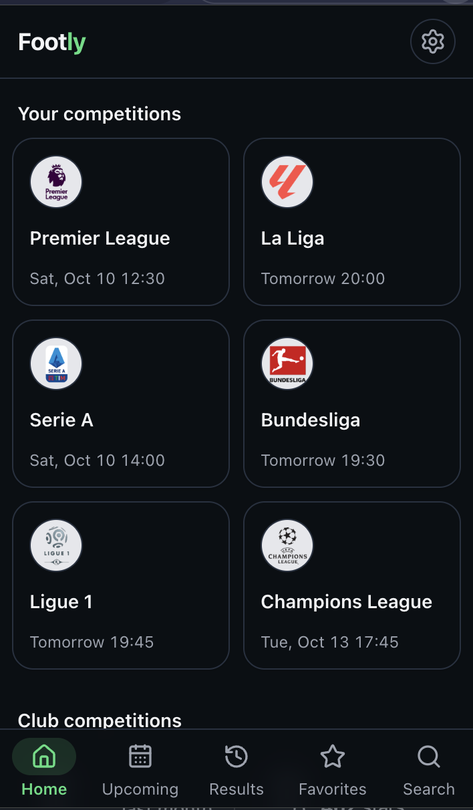
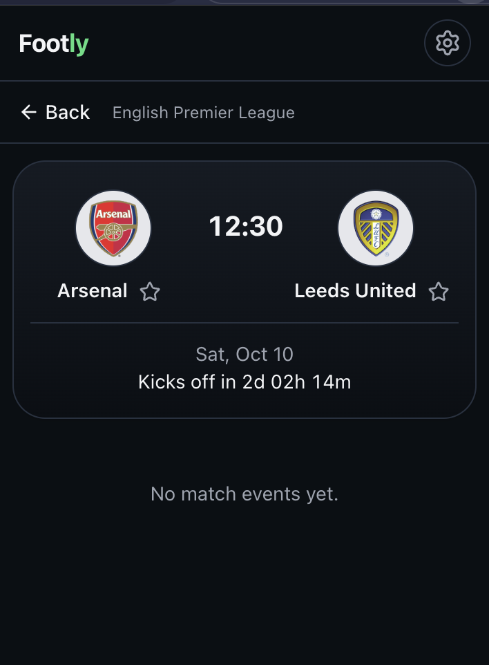
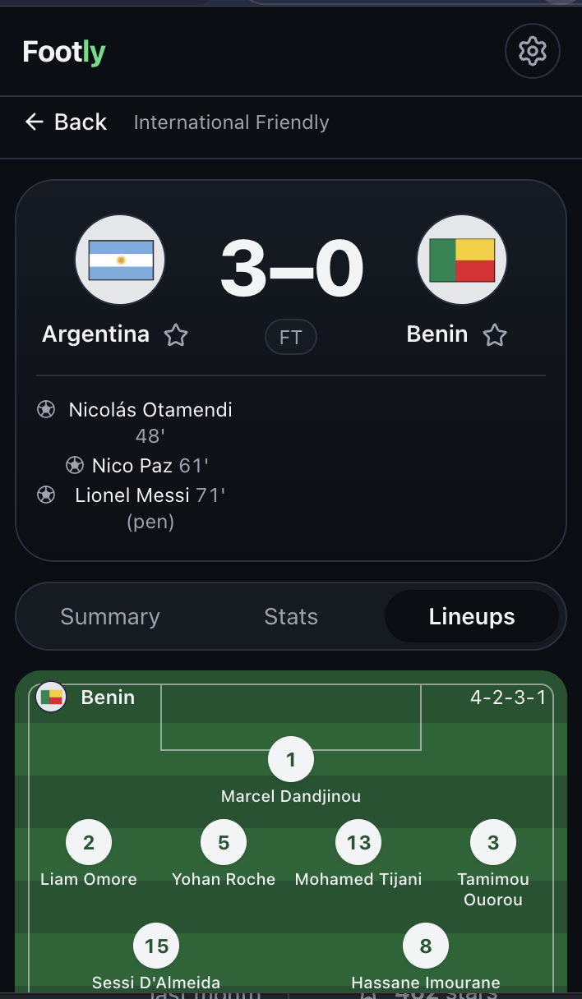
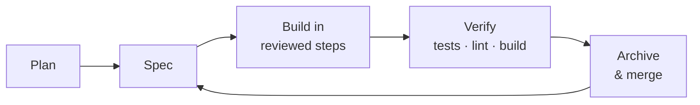

<div align="center">


# Footly

**Live scores, fixtures, and results in a compact Chrome popup.**

Your favorite teams first, match alerts when it matters, and nothing else in the way.


<br />


&nbsp;

&nbsp;


</div>

---

## ✨ Features

- 🏠 **Every competition on Home.** Your leagues first, with live counts or the next kickoff, then every club and national-team competition.
- 📋 **Match center.** Score header with goal scorers, plus **Summary**, **Stats**, and **Lineups** tabs:
  - a timeline split by team, with crests;
  - stat comparison bars;
  - starting lineups drawn on a pitch;
  - substitutes showing when they came on and who they replaced;
  - player photos where ESPN has them.
- ⭐ **Favorite teams.** Upcoming and recent matches for your teams, in every competition they play.
- 🔔 **Match alerts.** Kick-off, goals, red cards, and full-time results for your favorite teams.
- ⏱️ **Live and countdowns.** Clear upcoming, live, halftime, and full-time states, with a countdown to kickoff.
- 🔍 **Quick search.** Teams, competitions, and matches without leaving the popup.
- 🌗 **Dark and light themes.** Follows your system, or pick one in Settings.
- 📶 **Offline-aware.** Friendly error and offline states, each with a retry.

## 🔒 Privacy

No account, no tracking, no ads. Favorites and settings stay on your device.
Match data comes from ESPN's public football endpoints. Footly asks for no host
permissions and only these three:

| Permission | Why |
| --- | --- |
| `storage` | Saves your favorites, settings, and recent match data on this device. |
| `alarms` | Wakes Footly around your favorite teams' kickoffs to check for alerts. |
| `notifications` | Shows kick-off, goal, red card, and result alerts. |

The full policy is in [PRIVACY.md](PRIVACY.md).

## 🚀 Getting started

Requires Node.js and npm.

```bash
npm install
npm run dev      # Vite dev server
npm test         # Vitest, single run
npm run lint
```

To load it in Chrome:

1. Run `npm run build`.
2. Open `chrome://extensions` and turn on **Developer mode**.
3. Click **Load unpacked** and select `dist/`.

## 📦 Release

```bash
npm run package  # builds, then zips dist/ to release/footly-<version>.zip
```

[STORE_LISTING.md](STORE_LISTING.md) holds the Chrome Web Store text, the
permission justifications, the screenshot guide, and the submission checklist.
The extension icon is generated by `node scripts/generate-icons.mjs`.

## 🌐 Website

`site/` holds the landing page and the privacy policy (served at `/privacy`). It
is plain HTML and CSS with no build step, separate from the extension build.

```bash
python3 -m http.server 4173 -d site  # preview at http://localhost:4173
```

To deploy on Vercel, import this repository and set **Root Directory** to
`site`, **Framework Preset** to "Other", and leave the build command empty.

Once the Chrome Web Store listing is live, set `STORE_URL` in `site/main.js`;
every "Add to Chrome" button uses it. `site/site.test.ts` fails if the site's
privacy text drifts from `PRIVACY.md` or the extension's permission reasons.

## 🧭 How it was built

Footly was built with a **spec-driven development (SDD)** workflow using
[**AI Blueprint**](https://ai-blueprint.dev/). Every feature and fix started as
a written spec before any code, was built in small reviewed steps, was verified
with tests, lint, and a production build, and was then archived and merged as
one commit.



The whole trail is in the repo:

- [`blueprint/build-plan.md`](blueprint/build-plan.md) is the ordered feature plan.
- [`blueprint/history/features/`](blueprint/history/features/) and
  [`blueprint/history/fixes/`](blueprint/history/fixes/) hold one archived spec
  for every shipped feature and fix.
